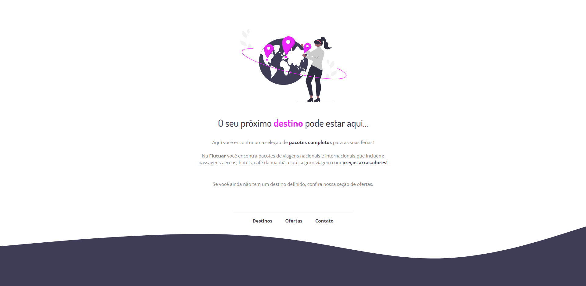

# Desafio - Flutuar

Acesse o projeto: [aqui](https://jonasncsantos.github.io/desafio-Flutuar/)

# Sobre o projeto

Este projeto foi um desafio do curso Explorer da [Rocketseat](https://www.rocketseat.com.br/) com o objetivo de praticar HTML e CSS através da construção de uma página para uma agência de viagem. Foram utilizados os seguintes recursos:

- HTML semântico para uma melhor organização do conteúdo e acessibilidade;
- CSS para estilização do layout e deixar a página mais atraente visualmente;
- Variáveis CSS para facilitar a manutenção e alteração das cores utilizadas;